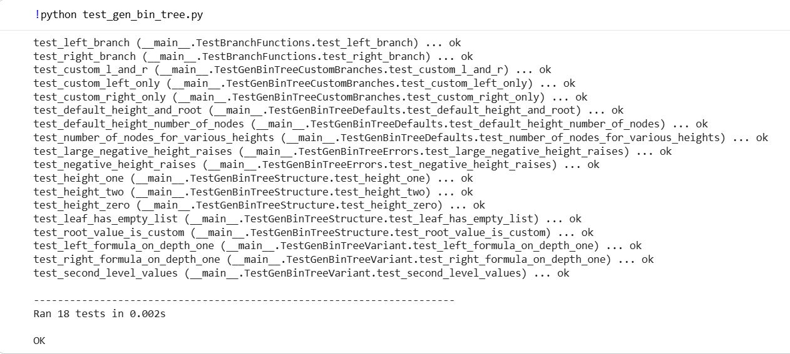
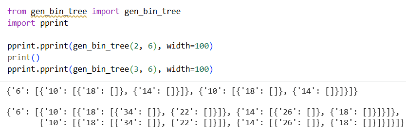

# Лабораторная работа: бинарное дерево (итеративная версия)

## Вариант
- root = 6, height = 5
- left_leaf = (root * 2) - 2
- right_leaf = root + 4

## Реализация
Файл `gen_bin_tree.py`. Построение **нерекурсивное** — через стек задач. Функции:
- `left_branch(root)` → `(root * 2) - 2`
- `right_branch(root)` → `root + 4`
- `gen_bin_tree(height=5, root=6, l_b=..., r_b=...)` — основная функция
- `_clean(node)` — замена оставшихся `None` на `[]` для листьев

Формат узла: `{"значение": [левый, правый]}`, лист — `{"значение": []}`.

## Тесты
Файл `test_gen_bin_tree.py` — 18 тестов `unittest`: формулы, структура дерева для высот 0–2, значения по умолчанию, подмена ветвлений, обработка ошибок, число узлов.

## Демонстрация работы

